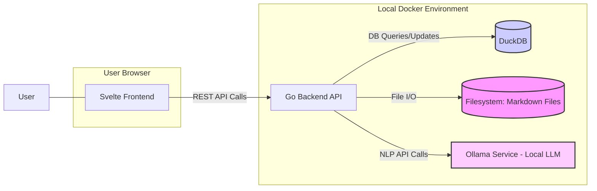
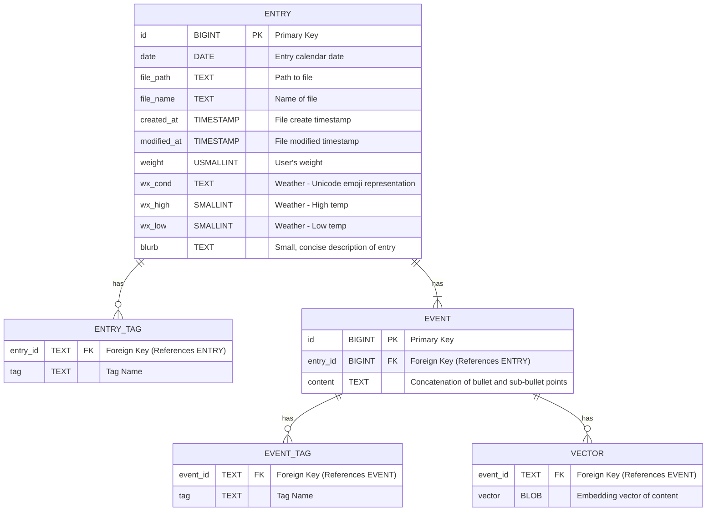

# Second Brain: Requirements Specification

## 1. Introduction

### 1.1 Purpose
To create a personal, web-based journaling application focused on capturing daily events using Markdown. The system prioritizes local data storage, an Obsidian-like user experience, and advanced search capabilities including natural language queries powered by local AI models.

### 1.2 Goals
* Provide a fast, intuitive interface for daily markdown journaling.
* Implement robust search features: text, metadata, and semantic search.
* Enable natural language querying of journal entries using local LLMs.
* Ensure data privacy and control through local-first deployment via Docker.
* Replicate key usability aspects of the Obsidian interface within a web browser.

### 1.3 Scope
* **In Scope:** Markdown file management (daily structure), YAML frontmatter support, web UI (editor, viewer, navigation, metadata panel), multiple search types (text, tag, property, date, vector), local LLM integration (Ollama), Docker-based deployment.
* **Out of Scope (Initially):** Real-time collaboration, cloud synchronization (beyond potential VPN access), mobile-native applications, advanced Obsidian plugin compatibility.

## 2. Functional Requirements

### 2.1 Journaling Core
* **FR-JRN-01:** The system must manage journal entries as individual Markdown files.
* **FR-JRN-02:** A new Markdown file must be automatically created for the current day upon first access if it doesn't exist.
* **FR-JRN-03:** Files must follow the naming convention: `YYYY.MM.DD-Weekday.md`.
* **FR-JRN-04:** The system must support Obsidian-compatible YAML frontmatter within each journal file for metadata (e.g., tags, custom properties).
* **FR-JRN-05:** The system should support user-defined daily note templates.
* **FR-JRN-06:** The Markdown editor must support standard Markdown syntax, including nested bullet points.
* **FR-JRN-07:** Users must be able to define and assign tags and properties (key-value pairs) to entries via YAML frontmatter.
* **FR-JRN-08:** The system must parse markdown bullet points as discrete "events" within each journal entry.
* **FR-JRN-09:** Sub-bullets (nested bullets) under a parent bullet must be treated as supporting details for that event.
* **FR-JRN-10:** When searching or querying, the system must be able to retrieve events (bullets) individually rather than entire daily entries.
* **FR-JRN-11:** For semantic search and NLP queries, each event (with its supporting details) should be treated as a discrete unit of content for embedding and retrieval.

### 2.2 Search and Retrieval
* **FR-SRC-01:** Users must be able to perform full-text searches across all journal entries.
* **FR-SRC-02:** Search results must be filterable by tags.
* **FR-SRC-03:** Search results must be filterable by YAML frontmatter properties.
* **FR-SRC-04:** Search results must be filterable by date or date range.
* **FR-SRC-05:** The system must support semantic search based on vector similarity of entry content.
* **FR-SRC-06:** Users must be able to navigate entries chronologically (e.g., via a calendar view or date picker).

### 2.3 Natural Language Processing (NLP)
* **FR-NLP-01:** The system must provide an interface for users to input natural language queries about their journal entries.
* **FR-NLP-02:** NLP queries must be processed using a local Large Language Model (LLM) via Ollama.
* **FR-NLP-03 (Revised):** The system must employ a **hybrid Retrieval-Augmented Generation (RAG)** strategy. This involves:
	- Analyzing the user's query (potentially guided by the LLM or pre-processing logic) to determine the most promising initial retrieval method(s).
	- Utilizing one or a combination of retrieval methods based on the analysis, including: vector similarity search, full-text search (FTS), tag filtering, property filtering, and date range filtering derived from the query.
	- Retrieving relevant journal entry content and/or metadata based on the selected method(s) to serve as context for the LLM.
* **FR-NLP-04:** LLM and embedding generation must utilize local GPU resources for acceleration.
* **FR-NLP-05:** The system must **pre-process user queries to resolve relative or ambiguous date/time references** (e.g., "last year", "yesterday", "next month") into specific dates or date ranges using standard date/time logic. This resolution should occur _before_ executing the primary RAG retrieval step.
- **FR-NLP-06:** The system should **rewrite the user query** to incorporate the resolved dates/times before passing it to the RAG retrieval selection process or the LLM, enhancing clarity. (e.g., "What did I get Terri for her birthday last year?" might be internally processed with a date filter for 2024).
- **FR-NLP-07:** The RAG retrieval process must be **iterative and corrective**. If the initially chosen retrieval strategy (or combination) yields insufficient or low-relevance results (based on defined thresholds or LLM assessment), the system must automatically attempt alternative retrieval methods or refined query parameters to find relevant context before finalizing the LLM response.

### 2.4 Web Interface (UI)
* **FR-UI-01:** The web interface must present a three-panel layout: File Navigation (Left), Editor/Viewer (Center), Metadata/Properties (Right).
* **FR-UI-02:** The UI must be responsive and usable across different screen sizes.
* **FR-UI-03:** A dark theme, visually similar to the user's specified Obsidian setup, must be available (see "example_UI.png" screenshot).
* **FR-UI-04:** The file navigation panel must display the journal directory structure.
* **FR-UI-05:** The metadata panel must display and allow editing of the current file's YAML frontmatter (tags, properties).
* **FR-UI-06:** The center panel must provide a Markdown editor with a live preview or toggleable preview mode.
* **FR-UI-07:** Basic note linking (e.g., `[[YYYY.MM.DD-Weekday]]`) should be supported visually or functionally.

## 3. Non-Functional Requirements

### 3.1 Performance
* **NFR-PERF-01:** Average page load time for typical journal entries: < 1 second.
* **NFR-PERF-02:** Standard search (text, tag, property) response time: < 200ms for a moderate number of entries (e.g., < 5000).
* **NFR-PERF-03:** Semantic search response time: < 1 second.
* **NFR-PERF-04:** NLP query response time (including RAG and LLM generation): < 5 seconds (dependent on LLM and context size).
* **NFR-PERF-05:** Embedding generation upon file save should not significantly impede the user's workflow.

### 3.2 Security
* **NFR-SEC-01:** All application components must run locally by default, minimizing external network dependencies.
* **NFR-SEC-02:** Web interface access must be served over HTTPS (using self-signed certs locally or proper certs if exposed).
* **NFR-SEC-03:** If remote access (e.g., via VPN or direct exposure) is configured, optional basic authentication must be available.

### 3.3 Usability
* **NFR-USA-01:** The application should default to opening today's journal entry on launch.
* **NFR-USA-02:** Key functions (search, new entry) must be easily accessible.
* **NFR-USA-03:** UI elements (panels, sections) should be collapsible/resizable where appropriate.

### 3.4 Maintainability
* **NFR-MAINT-01:** Code must adhere to standard Go and Svelte best practices.
* **NFR-MAINT-02:** Backend and Frontend concerns must be clearly separated.
* **NFR-MAINT-03:** Docker configuration must support easy local development workflows (e.g., hot-reloading for backend).

### 3.5 Data Management
* **NFR-DATA-01:** Journal data (Markdown files) must be stored directly on the host filesystem via Docker volume mounts.
* **NFR-DATA-02:** Database data (metadata index, vectors) must persist across container restarts via Docker volume mounts.
* **NFR-DATA-03:** The primary data source remains the Markdown files; the database serves as an index/cache.

## 4. System Architecture

### 4.1 Overview
A containerized web application consisting of a Go backend API, a Svelte frontend, a DuckDB database, and integration with a local Ollama service. Communication follows a standard client-server REST API pattern.



### 4.2 Components
* **Frontend:** Svelte single-page application (SPA) providing the UI. Responsible for rendering views, handling user input, and communicating with the Backend API.
* **Backend API:** Go-based RESTful API. Responsible for business logic, file system operations (reading/writing Markdown), database interactions (querying metadata, FTS, vectors), and orchestrating calls to the Ollama service.
* **Database:** DuckDB instance. Stores indexed metadata (filenames, paths, dates, tags, properties), full-text search indexes, and vector embeddings.
* **NLP Service:** External local Ollama instance. Provides embedding generation and LLM inference capabilities, accessed via its API.
* **Web Server (Optional/Proxy):** Nginx container (or similar) potentially used for serving static frontend assets, acting as a reverse proxy to the Go API, and handling HTTPS termination.

### 4.3 Data Flow Example (NLP Query)
1.  User inputs query into Svelte frontend.
2.  Frontend sends query to Backend API (`/api/query/nlp`).
3.  Backend API sends query text to Ollama for embedding.
4.  Backend API uses the resulting vector to query DuckDB for semantically similar journal entry vectors.
5.  Backend API retrieves the content of the top N relevant Markdown files from the filesystem.
6.  Backend API constructs a prompt (including retrieved context) and sends it to Ollama for generation.
7.  Backend API receives the LLM response.
8.  Backend API sends the formatted response back to the Svelte frontend.
9.  Frontend displays the response to the user.

## 5. Technical Specifications

### 5.1 Backend
* **Language/Framework:** Go (using standard library `net/http` or a lightweight router like Chi or Gin).
* **Database Interaction:** DuckDB Go driver. SQL for queries.
* **File System:** Standard Go `os` and `io/ioutil` packages for file operations.
* **NLP Integration:** HTTP client calls to the Ollama API endpoint(s) for embedding and generation.
* **Indexing:** Logic to parse Markdown files (including YAML frontmatter) upon creation/modification and update DuckDB indexes (metadata, FTS, vectors). Triggered by file save or a background watcher.
* **Embedding Model:** Use `nomic-embed-text` for semantic search.

### 5.2 Frontend
* **Framework:** Svelte / SvelteKit
* **Styling:** Tailwind CSS utility-first framework. Configuration to match target dark theme.
* **Markdown Editor:** CodeMirror 6 configured for Markdown.
* **Markdown Rendering:** `marked.js` or similar library for HTML preview.
* **Interactivity:** Alpine.js (optional, if needed for small dynamic behaviors outside Svelte components).
* **API Communication:** Standard `Workspace` API or a lightweight HTTP client library.

### 5.3 Database (DuckDB)
* **Schema:**
    * `entry`: (id BIGINT PRIMARY KEY, date DATE UNIQUE, file_path TEXT, file_name TEXT, created_at TIMESTAMP, modified_at TIMESTAMP, weight USMALLINT, wx_cond TEXT, wx_high SMALLINT, wx_low SMALLINT, blurb TEXT)
    * `entry_tag`: (entry_id BIGINT, tag TEXT) -- For entry-level tags
    * `event`: (id BIGINT PRIMARY KEY, entry_id BIGINT, content TEXT, has_children BOOLEAN) -- For bullet points (events)
    * `event_tag`: (event_id BIGINT, tag TEXT) -- For event-level tags
    * `vector`: (event_id BIGINT, vector BLOB) -- Vectors for events (including their details)
    * FTS Index: Created on event content using DuckDB's `fts` extension.
* **Usage:** Metadata querying, FTS, vector similarity search (`array_cosine_similarity` or dedicated vector functions).



### 5.4 Deployment (Docker)
* **Orchestration:** Docker Compose (`compose.yaml`).
* **Services:**
    * `backend`: Go application container. Mounts journal directory volume. Hot-reloading enabled for dev.
    * `database`: DuckDB instance. Mounts database storage volume. (Note: DuckDB can also run embedded in the Go app, simplifying deployment but coupling lifecycles). *Decision needed: Embedded or Separate Container?*
    * `frontend`: Build-stage container to compile Svelte app, runtime likely served by Nginx or Go backend.
    * `nginx` (Optional): Serves static frontend assets, reverse proxies API requests to `backend`, handles SSL.
* **Volumes:**
    * `journal_files`: Mounts host directory containing Markdown files into `backend`.
    * `duckdb_data`: Persists DuckDB database file(s).
* **Networking:** Defined network for inter-container communication. Port mapping for browser access (e.g., `8080:80` or `443:443`).

## 6. Development Roadmap

### Phase 1: Core MVP
* **Goal:** Basic journaling and viewing functionality.
* **Tasks:** Setup Go backend with basic file read/write, Setup Svelte frontend with CodeMirror editor and basic file list, Docker Compose setup for Go+Svelte, Implement daily note creation logic.
* **Deliverable:** Locally runnable app to create, view, and edit daily Markdown notes.

### Phase 2: Search & Metadata
* **Goal:** Implement robust search and Obsidian-like UI elements.
* **Tasks:** Implement DuckDB integration, File parsing for YAML frontmatter, Metadata indexing, Text search implementation, Tag/Property filtering, Develop 3-panel UI layout, Implement Properties panel.
* **Deliverable:** App with functional text/metadata search and refined UI.

### Phase 3: AI Features
* **Goal:** Integrate semantic search and NLP querying.
* **Tasks:** Implement embedding generation on file save, Integrate Ollama client in backend, Build vector index in DuckDB, Implement semantic search endpoint, Create NLP query interface in frontend, Implement RAG logic in backend.
* **Deliverable:** App with functional semantic search and natural language query capability.

### Phase 4: Polish & Refinement
* **Goal:** Improve UX, performance, and add auxiliary features.
* **Tasks:** UI theme polishing, Responsiveness improvements, Implement daily templates, Add note linking support, Performance optimization (query tuning, caching), Investigate backup/export options, Add optional basic authentication.
* **Deliverable:** Feature-complete, polished v1.0 application.

## 7. Appendix

### 7.1 Example Daily Entry (directly from Obsidian)
```markdown
---
date: 2025-03-11
month: "[[March-2025]]"
weight: 
wx_cond: 🌤
wx_high: 75
wx_low: 36
tags:
  - parenting
  - purchases/subcriptions
  - band
  - archery/practice
blurb: "Band parent meeting"
---
**B @Home**. 12 oz coffee
**L @[Jimmy John's](Places/Jimmy-John's.md)**. [Chicken Bacon Ranch Sandwich](Chicken-Bacon-Ranch-Sandwich) toasted
**D @[Augusta's](Places/Augusta's.md)**. [Mozzarella Sticks](Comestibles/Cheese-Sticks.md) and 6x [Boneless Wings](Comestibles/Boneless-Wings.md) in hot
**S @Home**. Brownies

## Notes
- Late getting the kids to school this morning because the kids were dragging ass. #parenting 
- Went with [Terri](People/Terri.md) to the chiropractor and then we ate lunch together.
- I purchased a lifetime license for [Obsidian-Copilot](Obsidian-Copilot.md) for *$299.99*. #purchases/subcriptions 
- [Mia](People/Mia.md) said she shot a 48 @ 10M this afternoon at #archery/practice.
- I went to the #band parent meeting tonight by myself because [Terri](People/Terri.md) wasn't feeling well.
	- Band Banquet moved to Friday, April 25 @ 6:30pm because Prom is on the original night they'd planned.
	- April 8th for new officers
	- *$225* for band fees.
- Finished watching [Zero Day](Shows/Zero-Day.md).
```

### 7.2 Example Daily Template (using Obsidian's `Templater` plugin logic)
```markdown
---
date: <% tp.file.title.slice(0, 10).replace(/\./g,'-') %>
month: "[[<% tp.date.now("MMMM-YYYY", 0, tp.file.title.slice(0, 10).replace(/\./g,'-'), "YYYY-MM-DD") %>]]"
weight: 
wx_cond: 
wx_high: 
wx_low: 
tags: 
blurb: 
---
**B @Home**. 12 oz coffee
**L @
**D @
**S @

## Notes
- 
```