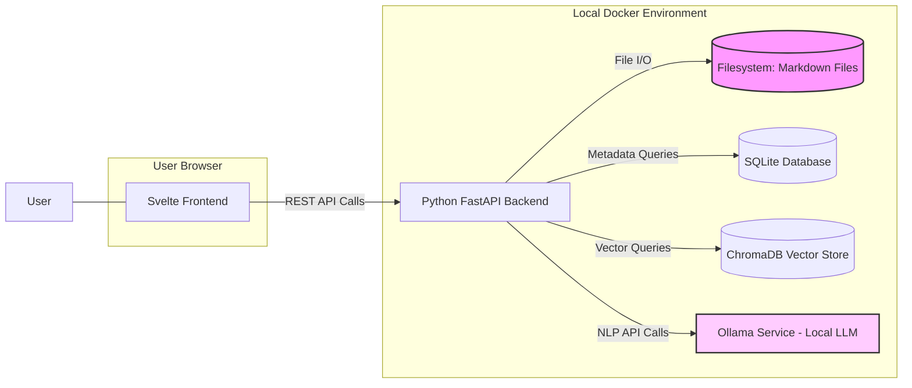
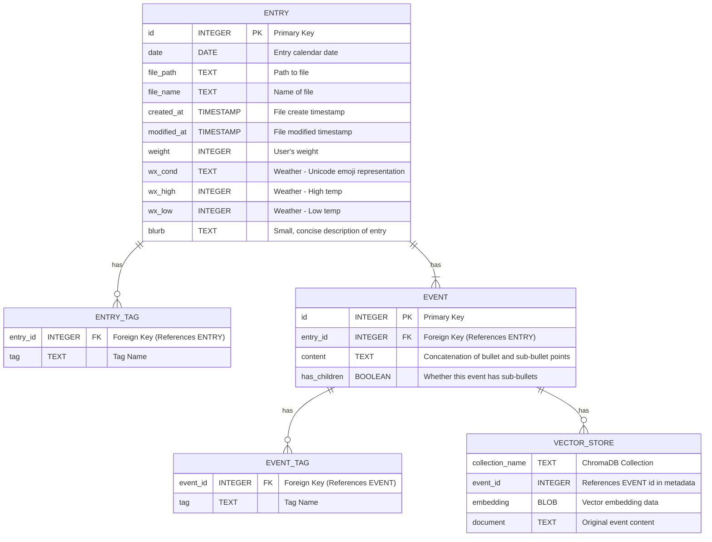

# Second Brain: Requirements Specification

## 1. Introduction

### 1.1 Purpose
To create a personal, web-based journaling application focused on capturing daily events using Markdown. The system prioritizes local data storage, an Obsidian-like user experience, and advanced search capabilities including natural language queries powered by local AI models.

### 1.2 Goals
* Provide a fast, intuitive interface for daily markdown journaling.
* Implement robust search features: text, metadata, and semantic search.
* Enable natural language querying of journal entries using local LLMs.
* Ensure data privacy and control through local-first deployment via Docker.
* Replicate key usability aspects of the Obsidian interface within a web browser.

### 1.3 Scope
* **In Scope:** Markdown file management (daily structure), YAML frontmatter support, web UI (editor, viewer, navigation, metadata panel), multiple search types (text, tag, property, date, vector), local LLM integration (Ollama), Docker-based deployment.
* **Out of Scope (Initially):** Real-time collaboration, cloud synchronization (beyond potential VPN access), mobile-native applications, advanced Obsidian plugin compatibility.

## 2. Functional Requirements

### 2.1 Journaling Core
* **FR-JRN-01:** The system must manage journal entries as individual Markdown files.
* **FR-JRN-02:** A new Markdown file must be automatically created for the current day upon first access if it doesn't exist.
* **FR-JRN-03:** Files must follow the naming convention: `YYYY.MM.DD-Weekday.md`.
* **FR-JRN-04:** The system must support Obsidian-compatible YAML frontmatter within each journal file for metadata (e.g., tags, custom properties).
* **FR-JRN-05:** The system must support a user-defined daily note template stored as a Markdown file named `daily_template.md` located in the root of the journal. The system should replace simple placeholders (e.g., {{DATE}}, {{MONTH_LINK}}, {{PREV_DAY_LINK}}, {{NEXT_DAY_LINK}}) within the template when creating a new daily note. Specific placeholders TBD.
* **FR-JRN-06:** The Markdown editor must support standard Markdown syntax, including nested bullet points.
* **FR-JRN-07:** Users must be able to define and assign tags and properties (key-value pairs) to entries via YAML frontmatter.
* **FR-JRN-08:** The system must parse markdown bullet points as discrete "events" within each journal entry. For the purpose of this system, every top-level bullet point within the "## Notes" section or similar designated content area is considered a discrete event.
* **FR-JRN-09:** Sub-bullets (nested bullets) under a parent bullet must be treated as supporting details for the parent event.
* **FR-JRN-10:** When searching or querying, the system must be able to retrieve events (bullets) individually rather than entire daily entries.
* **FR-JRN-11:** For semantic search and NLP queries, each event (with its supporting details) should be treated as a discrete unit of content for embedding and retrieval. Tags found within the text of an event bullet (e.g., #tagname) should be parsed and associated with the event in the database (`event_tag` table), in addition to any tags defined in the entry's YAML frontmatter.

### 2.2 Search and Retrieval
* **FR-SRC-01:** Users must be able to perform full-text searches across all journal entries.
* **FR-SRC-02:** Search results must be filterable by tags.
* **FR-SRC-03:** Search results must be filterable by YAML frontmatter properties.
* **FR-SRC-04:** Search results must be filterable by date or date range.
* **FR-SRC-05:** The system must support semantic search based on vector similarity of entry content.
* **FR-SRC-06:** Users must be able to navigate entries chronologically (e.g., via a calendar view or date picker).

### 2.3 Natural Language Processing (NLP)
* **FR-NLP-01:** The system must provide an interface for users to input natural language queries about their journal entries.
* **FR-NLP-02:** NLP queries must be processed using a local Large Language Model (LLM) via Ollama.
* **FR-NLP-03:** The system must employ a **multi-stage, adaptive Retrieval-Augmented Generation (RAG)** strategy. This involves:
    - Using the LLM to analyze the query to identify key elements: people, places, events, time periods, and the information type being requested
    - Selecting the most promising initial retrieval method(s) based on query analysis (vector search for conceptual queries, metadata filtering for specific attributes, date filtering for temporal queries)
    - Retrieving relevant journal entry content and/or metadata using the selected method(s)
    - Having the LLM evaluate the relevance and completeness of the retrieved context
    - If necessary, initiating additional retrieval attempts with alternative methods until sufficient context is found or the system determines the information isn't available
* **FR-NLP-04:** LLM and embedding generation must utilize local GPU resources for acceleration.
* **FR-NLP-05:** The system must **pre-process user queries to resolve relative or ambiguous date/time references** (e.g., "last year", "yesterday", "next month") into specific dates or date ranges using standard date/time logic. This resolution should occur _before_ executing the primary RAG retrieval step.
* **FR-NLP-06:** The system should **rewrite the user query** to incorporate the resolved dates/times before passing it to the RAG retrieval selection process or the LLM, enhancing clarity. (e.g., "What did I get Terri for her birthday last year?" might be internally processed with a date filter for 2024).
* **FR-NLP-07:** The system should implement a **context window management strategy** that:
    - Prioritizes the most relevant memories (events) for inclusion in the LLM context
    - Includes appropriate temporal context (events before/after) when beneficial for answering the query
    - Structures the context efficiently to maximize the number of relevant memories that can fit in the LLM's context window
    - NOTE: For the MVP, prioritization based primarily on vector similarity ranking is sufficient, given the expected concise nature of individual events.
* **FR-NLP-08:** For queries about recurring events or patterns, the system should be able to **aggregate information across multiple entries** to identify trends and provide comprehensive answers (e.g., "How often did I go running last month?"). For the MVP, this primarily involves simple aggregation like COUNT(*) based on filters derived from the query (e.g., counting events with a specific tag within a date range). LLM-driven synthesis of patterns is a potential future enhancement.
* **FR-NLP-09:** The system should provide confidence indicators with responses. Confidence calculation should prioritize the presence of specific keywords from the query found directly in the source text, followed by the relevance scores from vector search. The number of source entries contributing to an answer should be considered but given lower weight. The method should convey whether the answer is based on explicit mentions or inferred information.

### 2.4 Web Interface (UI)
* **FR-UI-01:** The web interface must present a three-panel layout: File Navigation (Left), Editor/Viewer (Center), Metadata/Properties (Right).
* **FR-UI-02:** The UI must be responsive and usable across different screen sizes.
* **FR-UI-03:** A dark theme, visually similar to the user's specified Obsidian setup, must be available (see "example_UI.png" screenshot).
* **FR-UI-04:** The file navigation panel must display the journal directory structure.
* **FR-UI-05:** The metadata panel must display and allow editing of the current file's YAML frontmatter (tags, properties).
* **FR-UI-06:** The center panel must provide a Markdown editor with a live preview or toggleable preview mode.
* **FR-UI-07:** The system must support standard Markdown links (`[display text](link)`). Links pointing to other daily notes (e.g., `[Note Text](YYYY.MM.DD-Weekday.md)`) must be rendered as clickable links that navigate the user to that specific daily note within the application. Support for viewing backlinks is not required for the MVP but may be considered as a future enhancement.

### 2.5 Metadata & Entity Awareness
* **FR-META-01:** The system must recognize and index all tags (e.g., #medicine, #parenting) from journal entries.
* **FR-META-02:** The system must detect and index entity links (e.g., [[People/Terri]]) from journal entries.
* **FR-META-03:** The NLP query process must recognize when a user query likely relates to specific tags or entities and prioritize retrieval methods accordingly.
* **FR-META-04:** The system should maintain entity relationships based on co-occurrence in journal entries (e.g., which people are mentioned together). Implementing robust co-occurrence tracking and querying may require additional schema design (e.g., an `entity_relations` table) and is considered a post-MVP enhancement.
* **FR-META-05:** For entity-focused queries (e.g., "When did I last see [Person]?"), the system should retrieve all events mentioning that entity, sorted by recency.

### 2.6 Response Generation
* **FR-RESP-01:** When answering a query, the system must include direct references to the relevant journal entries that support its response.
* **FR-RESP-02:** When multiple journal entries contribute to an answer, the system should synthesize the information into a coherent response rather than listing individual entries.
* **FR-RESP-03:** For temporal queries (e.g., "when did..."), responses should include specific dates when available.
* **FR-RESP-04:** When a query cannot be answered with high confidence, the system should acknowledge this and provide the most relevant related information it could find.
* **FR-RESP-05:** For pattern-based queries (e.g., "how often..."), the system should provide quantitative summaries when possible.

### 2.7 Error Handling
* **FR-ERR-01:** If the connection to the Ollama service fails during NLP query processing or embedding generation, the system must inform the user that the AI features are unavailable and suggest checking the Ollama service status. Basic text/metadata search should still function.
* **FR-ERR-02:** If a Markdown file cannot be parsed (due to corruption or invalid format), the system should log the error, skip indexing that file, and potentially notify the user about the problematic file via logs or a dedicated UI section. It must not crash the application.
* **FR-ERR-03:** If a database operation fails (e.g., cannot write index data), the system must log the error. For read operations (like search), it should inform the user that results may be incomplete. For write operations (like saving/indexing), it should indicate the data might not be fully indexed yet and potentially implement a retry mechanism or flag for re-indexing.
* **FR-ERR-04:** When a search query (text, metadata, or NLP) yields zero results, the system must explicitly inform the user "No results found" rather than showing a blank screen or error.

## 3. Non-Functional Requirements

### 3.1 Performance
* **NFR-PERF-01:** Average page load time for typical journal entries: < 1 second.
* **NFR-PERF-02:** Standard search (text, tag, property) response time: < 200ms for a moderate number of entries (e.g., < 5000).
* **NFR-PERF-03:** Semantic search response time: < 1 second.
* **NFR-PERF-04:** NLP query response time (including RAG and LLM generation): < 5 seconds (dependent on LLM and context size).
* **NFR-PERF-05:** Embedding generation upon file save should not significantly impede the user's workflow.
* **NFR-PERF-06:** Embedding generation must be optimized to minimize latency:
    - Batch processing for initial indexing
    - Parallel processing where possible
    - Caching of generated embeddings
    - Prioritization of recently modified files

### 3.2 Security
* **NFR-SEC-01:** All application components must run locally by default, minimizing external network dependencies.
* **NFR-SEC-02:** Web interface access must be served over HTTPS (using self-signed certs locally or proper certs if exposed).
* **NFR-SEC-03:** If remote access (e.g., via VPN or direct exposure) is configured, optional basic authentication must be available.

### 3.3 Usability
* **NFR-USA-01:** The application should default to opening today's journal entry on launch.
* **NFR-USA-02:** Key functions (search, new entry) must be easily accessible.
* **NFR-USA-03:** UI elements (panels, sections) should be collapsible/resizable where appropriate.

### 3.4 Maintainability
* **NFR-MAINT-01:** Code must adhere to standard Python best practices (PEP 8).
* **NFR-MAINT-02:** Backend and Frontend concerns must be clearly separated.
* **NFR-MAINT-03:** Docker configuration must support easy local development workflows (e.g., hot-reloading for backend).

### 3.5 Data Management
* **NFR-DATA-01:** Journal data (Markdown files) must be stored directly on the host filesystem via Docker volume mounts.
* **NFR-DATA-02:** Database data (metadata index, vectors) must persist across container restarts via Docker volume mounts.
* **NFR-DATA-03:** The primary data source remains the Markdown files; the database serves as an index/cache.

### 3.6 Reliability
* **NFR-ERR-01:** The application backend must handle unexpected errors gracefully, logging sufficient detail for debugging (respecting log levels defined in configuration) without exposing sensitive information or stack traces to the user interface.

## 4. System Architecture

### 4.1 Overview
A containerized web application consisting of a Python FastAPI backend, a Svelte frontend, SQLite and ChromaDB for data storage, and integration with a local Ollama service. Communication follows a standard client-server REST API pattern.



### 4.2 Components
* **Frontend:** Svelte single-page application (SPA) providing the UI. Responsible for rendering views, handling user input, and communicating with the Backend API.
* **Backend API:** FastAPI-based RESTful API. Responsible for business logic, file system operations (reading/writing Markdown), database interactions (querying metadata, FTS, vectors), and orchestrating calls to the Ollama service.
* **Databases:** 
  * SQLite, storing indexed metadata (filenames, paths, dates, tags, properties) with full-text search capabilities.
  * ChromaDB, storing vector embeddings for semantic search.
* **NLP Service:** External local Ollama instance. Provides embedding generation and LLM inference capabilities, accessed via its API.
* **Web Server (Optional/Proxy):** Nginx container (or similar) potentially used for serving static frontend assets, acting as a reverse proxy to the FastAPI, and handling HTTPS termination.

### 4.3 Data Flow Example (NLP Query)
1.  User inputs query into Svelte frontend.
2.  Frontend sends query to Backend API (`/api/query/nlp`).
3.  Backend API extracts embeddings using SentenceTransformers library.
4.  Backend API uses the resulting vector to query ChromaDB for semantically similar journal entry vectors.
5.  Backend API retrieves the content of the top N relevant Markdown files from the filesystem.
6.  Backend API constructs a prompt (including retrieved context) and sends it to Ollama for generation.
7.  Backend API receives the LLM response.
8.  Backend API sends the formatted response back to the Svelte frontend.
9.  Frontend displays the response to the user.

### 4.4 Query Planner
* **FR-QP-01:** The system must implement a Query Planner component that acts as an intermediary between the LLM query analysis and database operations.
* **FR-QP-02:** The Query Planner must be able to translate natural language query intentions into specific database retrieval strategies.
* **FR-QP-03:** The Query Planner must support prioritization of different retrieval methods based on query characteristics (e.g., tag searches for tagged content, entity searches for queries about people/places).
* **FR-QP-04:** The Query Planner must be capable of executing multiple retrieval strategies in parallel or sequence as appropriate.
* **FR-QP-05:** The Query Planner must merge and rank results from different retrieval methods based on relevance to the original query.

### 4.5 Indexing Process Flow
* **FR-IDX-01:** The system must implement a file-watching mechanism that detects changes (creation, modification, deletion) to markdown files in the journal directory using the watchdog library.
* **FR-IDX-02:** Upon detecting a file change, the system must:
    - For new/modified files: Parse the file, extract metadata (YAML frontmatter), events (bullet points), tags, and generate embeddings. Then update the corresponding database records.
    - For deleted files: Remove all associated records from the database.
* **FR-IDX-03:** The indexing process must be non-blocking, allowing users to continue using the application during background indexing.
* **FR-IDX-04:** The system must maintain a queue of files to be indexed to handle rapid changes to multiple files.
* **FR-IDX-05:** Indexing status indicators should be visible in the UI when indexing is in progress.

### 4.6 File Write Safety
* **FR-WRITE-01:** Before writing changes to a markdown file, the system must:
    - Create a temporary backup of the original file (e.g., as `.filename.md.bak`)
    - Verify that the parsed structure of the modified content maintains integrity
    - Only upon successful verification, write the changes to the original file
* **FR-WRITE-02:** If a write operation fails, the system must:
    - Restore from the backup if possible
    - Log detailed error information
    - Notify the user of the failure and restoration attempt
* **FR-WRITE-03:** The system must implement a transaction-like approach for writing:
    - First write to a temporary file
    - Then perform an atomic rename operation to replace the original file
    - This minimizes the risk of partial writes leading to corruption
* **FR-WRITE-04:** The system should maintain a configurable number of daily backups in a separate directory

### 4.7 Initial Database Setup
* **FR-INIT-01:** Upon first startup or when detecting an empty database, the system must:
    - Scan the entire journal directory recursively for markdown files
    - Display a "First-time setup" indicator with progress information
    - Process all files to build the initial database state
* **FR-INIT-02:** The initial setup process must be resumable if interrupted
* **FR-INIT-03:** During initial setup, the system should provide estimates of completion time and progress
* **FR-INIT-04:** Basic application functionality (viewing and editing files) should be available during initial indexing, with search features becoming available as indexing progresses

## 5. Technical Specifications

### 5.1 Backend
* **Language/Framework:** Python with FastAPI.
* **Database Interaction:** SQLite (via SQLAlchemy ORM) and ChromaDB.
* **File System:** Python's pathlib and watchdog packages for file operations and monitoring.
* **NLP Integration:** Direct SentenceTransformers integration for embeddings and HTTP client calls to the Ollama API endpoint for LLM generation.
* **Indexing:** Logic to parse Markdown files (including YAML frontmatter) using libraries like PyYAML and markdown-it-py upon creation/modification and update database indexes.
* **Embedding Model:** SentenceTransformers with a suitable model like `all-MiniLM-L6-v2` for semantic search.
* **Concurrency:** Asyncio and FastAPI's built-in async support for non-blocking I/O operations.

### 5.2 Frontend
* **Framework:** Svelte / SvelteKit
* **Styling:** Tailwind CSS utility-first framework. Configuration to match target dark theme.
* **Markdown Editor:** CodeMirror 6 configured for Markdown.
* **Markdown Rendering:** `marked.js` or similar library for HTML preview.
* **Interactivity:** Alpine.js (optional, if needed for small dynamic behaviors outside Svelte components).
* **API Communication:** Standard fetch API or a lightweight HTTP client library.

### 5.3 Database Schema
* **SQLite Schema:**
    * `entry`: (id INTEGER PRIMARY KEY, date DATE UNIQUE, file_path TEXT, file_name TEXT, created_at TIMESTAMP, modified_at TIMESTAMP, weight INTEGER, wx_cond TEXT, wx_high INTEGER, wx_low INTEGER, blurb TEXT)
    * `entry_tag`: (entry_id INTEGER REFERENCES entry(id), tag TEXT, PRIMARY KEY (entry_id, tag))
    * `event`: (id INTEGER PRIMARY KEY, entry_id INTEGER REFERENCES entry(id), content TEXT, has_children BOOLEAN)
    * `event_tag`: (event_id INTEGER REFERENCES event(id), tag TEXT, PRIMARY KEY (event_id, tag))
    * Full-text search using SQLite's FTS5 extension: (CREATE VIRTUAL TABLE event_fts USING fts5(content, content='event', content_rowid='id'))
* **ChromaDB:**
    * Collection: `event_embeddings` with metadata referencing event_id from SQLite.



### 5.4 Deployment (Docker)
* **Orchestration:** Docker Compose (`compose.yaml`).
* **Services:**
    * `backend`: Python FastAPI application container. Mounts journal directory volume and config file. Hot-reloading enabled for dev.
    * `frontend`: Build-stage container to compile Svelte app, runtime served by Nginx or FastAPI static file serving.
    * `ollama`: Container running the Ollama service with appropriate models.
    * `nginx` (Optional): Serves static frontend assets, reverse proxies API requests to `backend`, handles SSL.
* **Volumes:**
    * `journal_files`: Mounts host directory containing Markdown files into `backend`.
    * `database_data`: Mounts host directory to persist the SQLite database file and ChromaDB data.
    * `config`: Mounts the host `config.yaml` file into the backend service.
* **Networking:** Defined network for inter-container communication. Port mapping for browser access (e.g., `8080:80` or `443:443`).

### 5.5 Configuration
* **TECH-CONF-01:** Application configuration shall be managed via a YAML file (e.g., config.yaml) mounted into the backend container.
* **TECH-CONF-02:** The configuration file must allow specifying:
    - Path to the journal directory (within the container).
    - Filename of the daily note template (e.g., daily_template.md).
    - Ollama service host URL and port.
    - Specific generation model name for Ollama.
    - SentenceTransformers model name for embeddings.
    - Application log level (e.g., DEBUG, INFO, WARN, ERROR).
* **TECH-CONF-03:** Default values should be provided for essential configurations where appropriate.

### 5.6 Database Management
* **TECH-DB-01:** The system must provide a "Re-Index All" function accessible via the UI that:
    - Optionally clears all existing database records (user-configurable)
    - Scans the entire journal directory for markdown files
    - Processes each file to rebuild the database index from scratch
    - Displays progress indicators during the operation
* **TECH-DB-02:** The system must implement an incremental sync mechanism that:
    - Compares file modification timestamps against the last indexed timestamp stored in the database
    - Only reprocesses files that have been modified since they were last indexed
    - Runs automatically on application startup and periodically while the application is running
    - Can be manually triggered by the user via a "Sync Now" button
* **TECH-DB-03:** The system must track orphaned database records (records referring to files that no longer exist) and remove them during sync operations.

### 5.7 Markdown Parsing Rules
* **TECH-PARSE-01:** The system must identify daily journal entries through the following rules:
    - Files must follow the naming convention: `YYYY.MM.DD-Weekday.md`
    - Files must contain valid YAML frontmatter at the beginning of the file
* **TECH-PARSE-02:** Events (discrete database entries) are extracted as follows:
    - Each top-level bullet point within a section titled "## Notes" (or other configured section name) represents one event
    - Sub-bullets under a top-level bullet are considered supporting details for that event
    - The event content stored in the database must include both the top-level bullet and all of its sub-bullets
* **TECH-PARSE-03:** Tags are identified and extracted from:
    - The "tags" array in the YAML frontmatter (applying to the entire entry)
    - Inline hashtags within bullet points (e.g., "#meeting") which apply to the specific event
* **TECH-PARSE-04:** Entity links (e.g., "[[People/Terri]]") must be parsed and stored in a separate table to enable entity-based queries

## 6. Development Roadmap

### Phase 1: Core MVP
* **Goal:** Basic journaling and viewing functionality.
* **Tasks:** Setup Python FastAPI backend with basic file read/write, Setup Svelte frontend with CodeMirror editor and basic file list, Docker Compose setup for FastAPI+Svelte, Implement daily note creation logic.
* **Deliverable:** Locally runnable app to create, view, and edit daily Markdown notes.

### Phase 2: Search & Metadata
* **Goal:** Implement robust search and Obsidian-like UI elements.
* **Tasks:** Implement SQLite integration, File parsing for YAML frontmatter, Metadata indexing, Text search implementation, Tag/Property filtering, Develop 3-panel UI layout, Implement Properties panel.
* **Deliverable:** App with functional text/metadata search and refined UI.

### Phase 3: AI Features
* **Goal:** Integrate semantic search and NLP querying.
* **Tasks:** Implement embedding generation on file save using SentenceTransformers, Setup ChromaDB for vector storage, Integrate Ollama client in backend, Build vector index, Implement semantic search endpoint, Create NLP query interface in frontend, Implement RAG logic in backend.
* **Deliverable:** App with functional semantic search and natural language query capability.

### Phase 4: Polish & Refinement
* **Goal:** Improve UX, performance, and add auxiliary features.
* **Tasks:** UI theme polishing, Responsiveness improvements, Implement daily templates, Add note linking support, Performance optimization (query tuning, caching), Investigate backup/export options, Add optional basic authentication.
* **Deliverable:** Feature-complete, polished v1.0 application.

## 7. Data Processing Implementation

### 7.1 Markdown Processing Workflow

* **IMPL-PROC-01:** The system must implement a file processing workflow that:
    - Separates YAML frontmatter from markdown body using regex pattern matching and PyYAML
    - Extracts metadata fields (date, weight, weather conditions, tags, blurb) from the frontmatter
    - Processes the markdown body to extract discrete events

* **IMPL-PROC-02:** Event extraction must follow these rules:
    - Each top-level bullet point (line starting with "- ") in the "## Notes" section is treated as a discrete event
    - Sub-bullets are concatenated to their parent bullet to form a complete event entry
    - Special formatting is applied to ensure proper sentence structure (e.g., adding periods at end if missing)
    - Embedded links should be preserved in the original file but simplified in the database representation

* **IMPL-PROC-03:** The system must implement proper tag extraction:
    - Tags from the frontmatter YAML apply to the entire entry
    - Inline hashtags within bullet points (e.g., "#meeting") apply to the specific event
    - Tags with hierarchical structure (e.g., "purchases/subscriptions") must be properly parsed and searchable by both the full tag and individual components

### 7.2 Database Synchronization Workflow

* **IMPL-SYNC-01:** The system must implement a two-way synchronization mechanism:
    - Reading from files to database: Triggered on startup, periodic sync, and manual "Re-Index" action
    - Writing from database to files: Triggered when edits are made through the UI

* **IMPL-SYNC-02:** For safe write operations, the system must:
    - Create a backup of the original file before modification
    - Maintain the exact structure of the original file, only changing the edited portions
    - Preserve all YAML frontmatter fields even if they're not used by the application
    - Use atomic file operations to prevent partial writes
  
* **IMPL-SYNC-03:** Database re-indexing must be implemented with the following options:
    - Full reindex: Clear database and process all files from scratch
    - Incremental sync: Only process files modified since last indexed (based on file timestamp)
    - Orphan cleanup: Remove database records for files that no longer exist

* **IMPL-SYNC-04:** The system must maintain a transaction log of all write operations to markdown files to enable:
    - Audit trail of changes
    - Potential rollback of changes if needed
    - Recovery in case of application crash during write operations

## 8. Implementation Challenges and Solutions

### 8.1 Editor Experience Enhancement

* **IMPL-EDITOR-01:** The system must implement a modern web-based Markdown editor using CodeMirror 6 with the following custom extensions:
    - Wiki-style link autocompletion that queries the backend for potential link targets as the user types
    - Markdown syntax highlighting with custom styling for wiki links, tags, and other special syntax
    - YAML frontmatter handling with schema validation
    - Support for keyboard shortcuts matching Obsidian's key bindings where possible

* **IMPL-EDITOR-02:** The Markdown preview functionality must:
    - Render wiki links (`[[link]]`) as proper clickable elements
    - Support real-time preview updating as the user types
    - Properly render embedded content references like images and file links
    - Include custom renderers for specific Markdown extensions (callouts, admonitions)

* **IMPL-EDITOR-03:** The system must implement a command palette similar to Obsidian's that allows users to:
    - Search for and execute common commands
    - Access editor functions without using the mouse
    - See keyboard shortcuts for available commands
    - Create custom commands via configuration (post-MVP feature)

### 8.2 Real-time Updates Architecture

* **IMPL-REALTIME-01:** The system must implement a websocket-based notification system that:
    - Establishes persistent connections between frontend clients and the backend
    - Pushes notifications about file changes to all connected clients
    - Updates the UI in real-time when changes occur, whether made through the UI or directly to the files

* **IMPL-REALTIME-02:** File system watching must be implemented using the watchdog package with:
    - Efficient event filtering to avoid unnecessary processing
    - Debouncing mechanisms to handle rapid successive changes
    - Graceful handling of temporary files created by text editors

* **IMPL-REALTIME-03:** The system must implement an optimistic UI update strategy that:
    - Updates the UI immediately when a user makes a change
    - Confirms changes with the backend asynchronously
    - Reconciles any conflicts if the file was changed externally

* **IMPL-REALTIME-04:** A change queue system must be implemented to:
    - Handle multiple rapid changes without database contention
    - Prioritize user-initiated changes over background processing
    - Ensure database consistency even with concurrent modifications

### 8.3 Performance Optimization for Large Vaults

* **IMPL-PERF-01:** The system must implement incremental indexing that:
    - Only processes files that have changed since last indexed
    - Uses file modification timestamps to detect changes
    - Maintains a manifest of indexed files with their timestamps

* **IMPL-PERF-02:** Background processing must be implemented with Python's concurrency primitives:
    - Use asyncio for I/O-bound tasks like file reading and API calls
    - Implement ThreadPoolExecutor for CPU-bound tasks like parsing and embedding generation
    - Use queues for coordinating between file watchers, indexers, and the API server

* **IMPL-PERF-03:** The system must implement a multi-level caching strategy:
    - In-memory cache for frequently accessed file content and search results
    - Disk-based cache for generated embeddings and other persistent computed data
    - Cache invalidation mechanisms tied to the file change notification system

* **IMPL-PERF-04:** Database query optimization must include:
    - Proper indexing on frequently queried columns in SQLite (date, tags, file_path)
    - For ChromaDB vector searches, use of appropriate nearest neighbor search parameters
    - Query plan monitoring and optimization for common query patterns

* **IMPL-PERF-05:** All list views must implement pagination to:
    - Limit the amount of data loaded at once
    - Support infinite scrolling or paged navigation in the UI
    - Pre-fetch adjacent pages to improve perceived performance

### 8.4 RAG Implementation Architecture

* **IMPL-RAG-01:** The system must implement a formal query planning pipeline that:
    - Analyzes the input query to identify key elements (entities, time references, question type)
    - Selects appropriate retrieval strategies based on the analysis
    - Combines multiple retrieval methods when appropriate

* **IMPL-RAG-02:** The system must implement a hybrid retrieval mechanism that:
    - Executes keyword, tag, metadata, and vector searches as appropriate
    - Blends results with configurable weights based on query characteristics
    - Ranks final results based on relevance to the original query

* **IMPL-RAG-03:** Context window management must be implemented with:
    - Intelligent chunking that preserves semantic meaning
    - Prioritization algorithms to include the most relevant information
    - Dynamic context assembly based on the available LLM context window size

* **IMPL-RAG-04:** Ollama integration must include:
    - A robust client with retry mechanisms, timeouts, and error handling
    - Background embedding generation to avoid blocking the UI
    - Fallback mechanisms for when the LLM service is unavailable

* **IMPL-RAG-05:** The system must include carefully designed prompt templates that:
    - Provide clear instructions to the LLM about the expected response format
    - Include relevant context from retrieved documents
    - Guide the LLM to cite sources appropriately in responses

## 9. Appendix

### 9.1 Example Daily Entry (directly from Obsidian)
```markdown
---
date: 2025-03-11
month: "[[March-2025]]"
weight: 
wx_cond: 🌤
wx_high: 75
wx_low: 36
tags:
  - parenting
  - purchases/subcriptions
  - band
  - archery/practice
blurb: "Band parent meeting"
---
**B @Home**. 12 oz coffee
**L @[Jimmy John's](Places/Jimmy-John's.md)**. [Chicken Bacon Ranch Sandwich](Chicken-Bacon-Ranch-Sandwich) toasted
**D @[Augusta's](Places/Augusta's.md)**. [Mozzarella Sticks](Comestibles/Cheese-Sticks.md) and 6x [Boneless Wings](Comestibles/Boneless-Wings.md) in hot
**S @Home**. Brownies

## Notes
- Late getting the kids to school this morning because the kids were dragging ass. #parenting 
- Went with [Terri](People/Terri.md) to the chiropractor and then we ate lunch together.
- I purchased a lifetime license for [Obsidian-Copilot](Obsidian-Copilot.md) for *$299.99*. #purchases/subcriptions 
- [Mia](People/Mia.md) said she shot a 48 @ 10M this afternoon at #archery/practice.
- I went to the #band parent meeting tonight by myself because [Terri](People/Terri.md) wasn't feeling well.
	- Band Banquet moved to Friday, April 25 @ 6:30pm because Prom is on the original night they'd planned.
	- April 8th for new officers
	- *$225* for band fees.
- Finished watching [Zero Day](Shows/Zero-Day.md).
```

### 9.2 Example Daily Template
```markdown
---
date: {{DATE}}
month: {{MONTH_LINK}}
weight: 
wx_cond: 
wx_high: 
wx_low: 
tags: 
blurb: 
---
**B @Home**. 12 oz coffee
**L @
**D @
**S @

## Notes
- 
```

### 9.3 Backend Component Architecture
```
secondbrain/
├── app/                   # FastAPI application
│   ├── api/               # API routes
│   │   ├── __init__.py
│   │   ├── entries.py     # Journal entry endpoints
│   │   ├── events.py      # Event (bullet) endpoints
│   │   ├── search.py      # Search endpoints
│   │   └── query.py       # Natural language query endpoints
│   ├── core/              # Core application logic
│   │   ├── __init__.py
│   │   ├── config.py      # Configuration management
│   │   ├── security.py    # Authentication (if needed)
│   │   └── logging.py     # Logging setup
│   ├── db/                # Database interactions
│   │   ├── __init__.py
│   │   ├── sqlite.py      # SQLite session and models
│   │   ├── chroma.py      # ChromaDB client
│   │   └── sync.py        # DB synchronization logic
│   ├── models/            # Data models (Pydantic)
│   │   ├── __init__.py
│   │   ├── entry.py       # Journal entry models
│   │   ├── event.py       # Event models
│   │   └── search.py      # Search/query models
│   ├── services/          # Business logic services
│   │   ├── __init__.py
│   │   ├── file_service.py     # File operations
│   │   ├── markdown_service.py # Markdown processing
│   │   ├── embedding_service.py # Embedding generation
│   │   ├── ollama_service.py   # LLM integration
│   │   └── rag_service.py      # RAG implementation
│   ├── utils/             # Utility functions
│   │   ├── __init__.py
│   │   ├── file_utils.py  # File handling utilities
│   │   ├── date_utils.py  # Date handling 
│   │   └── text_utils.py  # Text processing
│   ├── main.py            # FastAPI app initialization
│   └── static/            # Static files (if served by FastAPI)
│       └── index.html     # SPA entry point
├── tests/                 # Test suite
│   ├── __init__.py
│   ├── conftest.py        # Test fixtures
│   ├── test_api/          # API tests
│   ├── test_services/     # Service tests
│   └── test_utils/        # Utility tests
├── alembic/               # Database migrations
├── config.yaml            # Configuration file
├── requirements.txt       # Python dependencies
└── Dockerfile             # Docker build file
```

### 9.4 Core API Endpoints
```
GET    /api/health                  - Health check
GET    /api/entries                 - List all entries
GET    /api/entries/{date}          - Get entry by date
POST   /api/entries/{date}          - Create/update entry
GET    /api/entries/{date}/events   - Get events for entry
POST   /api/search/text             - Perform text search
POST   /api/search/semantic         - Perform semantic search
POST   /api/query/nlp               - Process natural language query
POST   /api/reindex                 - Trigger reindexing
GET    /api/reindex/status          - Get reindexing status
```

### 9.5 Frontend Component Structure
```
src/
├── lib/
│   ├── components/
│   │   ├── layout/
│   │   │   ├── ThreeColumnLayout.svelte
│   │   │   ├── NavigationPanel.svelte
│   │   │   ├── EditorPanel.svelte
│   │   │   └── MetadataPanel.svelte
│   │   ├── editor/
│   │   │   ├── MarkdownEditor.svelte
│   │   │   └── YamlEditor.svelte
│   │   ├── navigation/
│   │   │   ├── FileTree.svelte
│   │   │   └── Calendar.svelte
│   │   └── common/
│   │       ├── Button.svelte
│   │       └── Loader.svelte
│   ├── api/
│   │   └── client.js
│   └── stores/
│       ├── entries.js
│       └── ui.js
├── routes/
│   ├── +layout.svelte
│   ├── +page.svelte
│   └── entry/[date]/+page.svelte
└── app.html
```